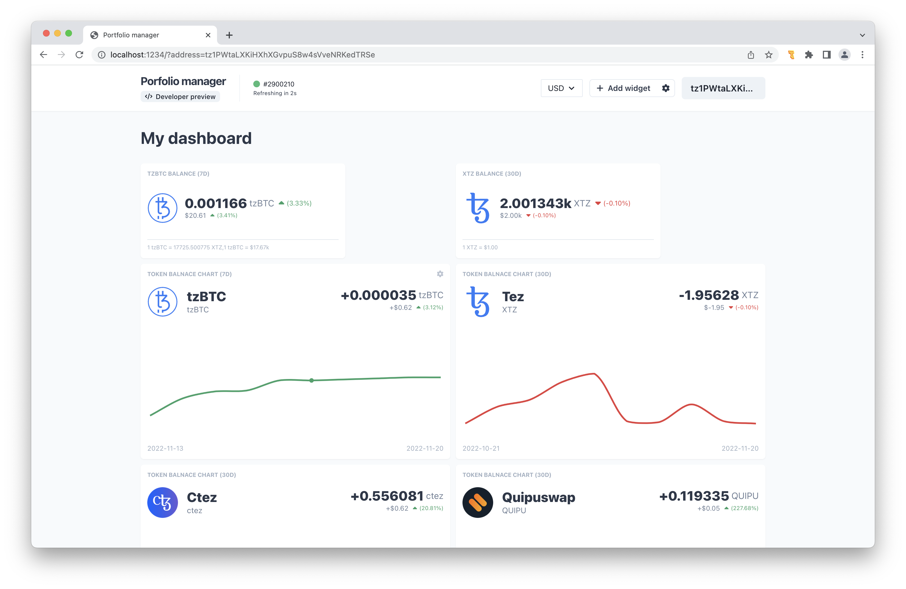
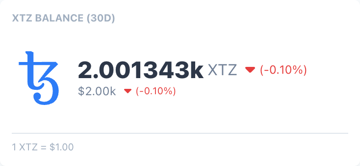
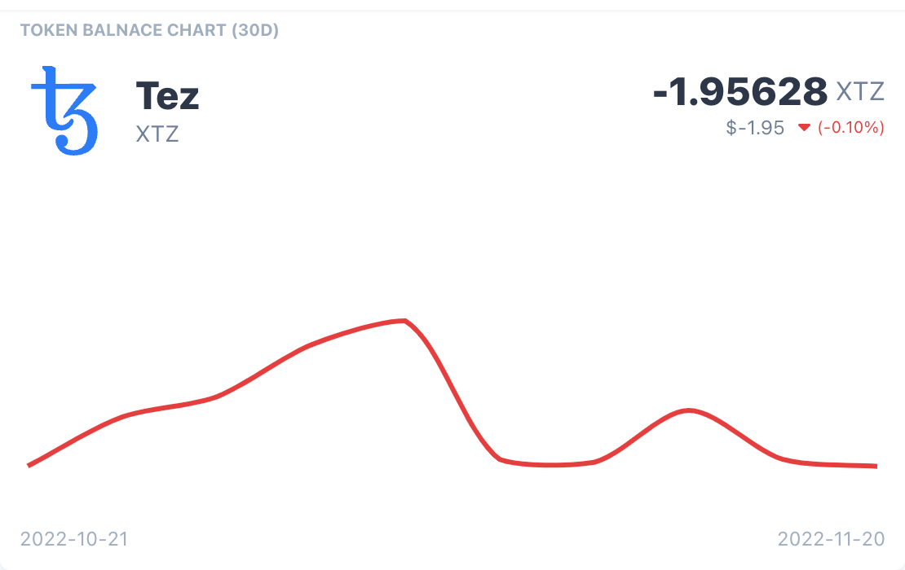

# Portfolio Manager by Stove Labs

[](https://app.netlify.com/sites/portfolio-manager-stove-labs/deploys)

The Portfolio Manager by Stove Labs is all-in-one Tezos dashboard with configurable widgets.


<center style="margin-top: -15px">
  <a href="portfolio-manager-stove-labs.netlify.app">🚨 Mainnet development preview 🚨</a>
</center>

## 🚀 Getting started

#### Development setup

> Make sure you're not missing any [dependencies](#dependencies) first.

In order to get started with development locally, run the following commands:

```zsh
# Clone the repository
git clone git@github.com:stove-labs/portfolio-manager.git
# Install project dependencies
npm install
# Run a local development server
npm run dev
# Open your browser at localhost:1234 to view the Portfolio Manager
```

#### Dependencies:

- Node.js `v17.8.0` + NPM `v8.5.5`
- Instance of TzKt.io API
  - Publicly available at: `https://api.tzkt.io`
  - You can alternatively run a [Taqueria](https://taqueria.io) sandbox which also includes the TzKt API locally
- Access to free and public [Coinbase prices API](https://docs.cloud.coinbase.com/sign-in-with-coinbase/docs/price-data)
  - Available publicly at: `https://api.coinbase.com/v2/prices`

#### Configuration:

> Default configuration can be found in the files linked for each configuration section below

The portfolio manager allows to configure the following options at development/build time:

- [Environment configuration](https://github.com/stove-labs/portfolio-manager/blob/develop/src/config/config/environment.ts)
- [Available FIAT currencies](https://github.com/stove-labs/portfolio-manager/blob/develop/src/config/config/currencies.ts)
  - Currency tickers specified here must be available via [Coinbase prices API](#dependencies)
- [Available on-chain tokens](https://github.com/stove-labs/portfolio-manager/blob/develop/src/config/config/tokens.ts)
  - Tokens specified here must have an XTZ/TOKEN pair on Quipuswap, otherwise the portfolio manager won't be able to determine it's XTZ & FIAT price

## 🎲 Available widgets

This section showcases the currently available/implemented widgets. All of the widgets above can be added to the dashboard using the in-app Widget Store.

### Token Balance

Token Balance widget shows the user's current token balance, together with it's fiat value.
It also shows the respective percentage change from historical to current balance, respective of the widget historical period settings.



### Relative Token Balance Change

Relative Token Balance Change widget shows the relative change in user's token balance over the specified historical period, together with it's fiat value.



## 🍪 Features

This section breaks down features from both the product and architectural standpoint with the goal to explain the design decision made during the development process.

### Normalised data store

It is an entity based local 'database' which allows widgets to store and share data in a normalised format, no matter where the data originated from. This ensures that any data requested or shown is going to be consistent across all the containers, components or pages.

Currently supported entities, with the respective APIs for working with them are:

- **Blocks** (Keeps track of latest/historical block data)
  - [Actions](https://github.com/stove-labs/portfolio-manager/blob/develop/src/features/chain/blocks/store/useBlocksActions.tsx#L9)
    - The only public facing action is currently `LOAD_LATEST_BLOCK`, since it's the only one required for the underlying [data refetching logic](#data-refetching). TODO: add data refetching section
  - [State](https://github.com/stove-labs/portfolio-manager/blob/develop/src/features/chain/blocks/store/useBlocksStore.tsx#L22)
    - Block `id` is either a `uuidv4` or `block.level`, depending on if the request has finished fetching or not (since block.level is unknown before the request finishes).
  - [Effects](https://github.com/stove-labs/portfolio-manager/blob/develop/src/features/chain/blocks/store/useBlocksEffects.tsx#L12)
  - [Library](https://github.com/stove-labs/portfolio-manager/blob/develop/src/features/chain/blocks/lib/blocks.tsx)
    - Fetching of block(s) data using the TzKT.io API
      - [`/v1/blocks/:level`](https://api.tzkt.io/#operation/Blocks_GetByLevel)
- **Balances** (Keeps track of balances for a given address/level/tokenId)
  - [Actions](https://github.com/stove-labs/portfolio-manager/blob/develop/src/features/chain/balances/store/useBalancesActions.tsx#L6)
    - Action for fetching both the current and historical balances is unified as `LOAD_BALANCES`. Since both can be represented as _balance at level_, while keeping in mind that the app is aware of the percieved _latest block level_ at all times.
  - [State](https://github.com/stove-labs/portfolio-manager/blob/develop/src/features/chain/balances/store/useBalancesStore.tsx#L9)
    - Balance `id` is `blockLevel-address-tokenId`, this allows us to store balances uniquely for any given address, tokenId and level combination. This is useful, since we also need to fetch balances of e.g. pools on Quipuswap to determine spot prices.
    - When it comes to historical data, the relative historial block at a given timestamp is estimated like [this](https://github.com/stove-labs/portfolio-manager/blob/develop/src/features/chain/blocks/store/useBlocksSelectors.tsx#L56).
  - [Effects](https://github.com/stove-labs/portfolio-manager/blob/develop/src/features/chain/balances/store/useBalancesEffects.tsx#L6)
  - [Library](https://github.com/stove-labs/portfolio-manager/blob/develop/src/features/chain/balances/lib/balances.tsx)
    - Fetching of native & tokens balances for both current and historical blocks
      - [`/v1/accounts/{address}/balance_history/{level}`](https://api.tzkt.io/#operation/Accounts_GetBalanceAtLevel)
      - [`/v1/tokens/historical_balance?...`](https://api.tzkt.io/#operation/Tokens_GetTokenBalances2)
- **Fiat** (Keeps track of the user's preffered FIAT currency and available spot prices between XTZ/FIAT)
  - [Actions](https://github.com/stove-labs/portfolio-manager/blob/develop/src/features/fiat/store/useFiatActions.tsx#L6)
  - [State](https://github.com/stove-labs/portfolio-manager/blob/develop/src/features/fiat/store/useFiatStore.tsx#L10)
  - [Effects](https://github.com/stove-labs/portfolio-manager/blob/develop/src/features/fiat/store/useFiatEffects.tsx#L6)
  - [Library](https://github.com/stove-labs/portfolio-manager/blob/develop/src/features/fiat/lib/fiat.tsx)
    - Fetching of spot prices for XTZ/FIAT (where FIAT = USD | EUR as per earlier configuration)
      - [`/v2/prices/XTZ-{fiat}`](https://docs.cloud.coinbase.com/sign-in-with-coinbase/docs/price-data)

#### State selectors / computed state

Due to the nature of how the data is stored in the normalised store, we can now implement various selectors giving us access to the data in different perspectives. One example might include accessing pool liquidity / spot price for a token through balances of the given pool.

This means that we only store the pool's liquidity, and we can calculate the spot price on the go from the normalised data. This ensures data consistency between widgets which want to display the actual liquidity information vs widgets which are only interested in the price itself.

Please see [issue #15](https://github.com/stove-labs/portfolio-manager/issues/15) for more insight into balances vs liquidity of pools.

#### Data freshness & invalidation (eviction)

Each widget is responsible for ensuring freshness of its displayed data, since e.g. balances can change every block. The latest block is fetched at a higher level than widget data, ensuring that all widgets are aware of the latest block at the same time. Down the line, if a widget is requesting balance for an address at a certain block level, it will also automatically refetch the balance if the level changes (e.g. new block is available).

If you leave the application running for a while, this will lead to memory leaks, since we're storing data that theoretically no widget will display again (unless user's configuration changes to different historical views).

There is a built in data evicition mechanism in the normalised data store, that keeps track of data that is being either actively displayed, or fetched for the current latest block. This means that the app will persist only the last e.g. 3 block levels worth of data across all entities. Implementation of the eviction mechanism can be found in:

- [`useLatestBlock()`](https://github.com/stove-labs/portfolio-manager/blob/develop/src/features/widgets/containers/Dashboard/hooks/useLatestBlock.tsx#L20)
- [`StoreEvictProvider`](https://github.com/stove-labs/portfolio-manager/blob/develop/src/store/providers/StoreEvictProvider.tsx)

### Price oracles (both on-chain and USD/EUR)

Prices for tokens are determined in $TOKEN/XTZ format through Quipuswap DEX. The XTZ/(EUR, USD) price is fetched from the public and free Coinbase API.
Resulting $TOKEN/(EUR,USD) price is routed through the XTZ pair accordingly. All prices are calculated through spot prices.

### Wallet management

The portfolio manager can't do much unless you connect a wallet. By default a prompt to connect your wallet is shown - this will lead you through the Beacon SDK wallet connection workflow, allowing you to connect with e.g. the Templte wallet.

#### Specifying the wallet/address via URL

As an alternative, you can specify which wallet you'd like to view the configured portfolio as using the query parameter `?address=tz1...`. This is useful since it allows you to use the Portfolio manager in a view only mode for any given _tz1/KT1_ address.

Example usage: `http://localhost:1234/?address=tz1PWtaLXKiHXhXGvpuS8w4sVveNRKedTRSe`

### 🎛️ Widget dashboard

The centerpiece of the Portfolio Manager is the widget dashboard, it allows the user to compose their desired widgets on a drag & drop grid.

#### Widget store

Widget store is a straightforward modal that shows a non-container version of all available widgets with some default configuration. Users can pick a widget from the store, and it will be automatically appended to the end of their dashboard configuration. You can find the available widget configuration [here](https://github.com/stove-labs/portfolio-manager/blob/develop/src/features/widgets/containers/WidgetStore/WidgetStore.tsx#L20).

#### Layout

Widgets are displayed based on the layout configuration. Users can drag & drop or re-arrange widgets to their liking and the configuration will be persisted accordingly. You can find the implementation of the layout handling [here](https://github.com/stove-labs/portfolio-manager/blob/develop/src/features/widgets/containers/WidgetsLayout/store/useWidgetsLayoutStore.tsx#L11).

##### Settings

Additionally, the widget layout can be exported to a JSON file. This JSON file can be used to import settings to the portfolio manager as well. You can find all persistable settings [here](https://github.com/stove-labs/portfolio-manager/blob/develop/src/features/widgets/containers/Dashboard/hooks/useSettings.tsx#L17).

Here's an example of the JSON settings export:

```json
{
  "widgetLayout": {
    "layout": [
      {
        "w": 6,
        "h": 6,
        "x": 0,
        "y": 3,
        "i": "f52534ad-62a7-432d-9c26-bf09ea908e65",
        "moved": false,
        "static": false
      }
    ],
    "widgets": [
      {
        "name": "TokenBalanceChartWidget",
        "id": "f52534ad-62a7-432d-9c26-bf09ea908e65",
        "settings": { "token": "24975299837953", "historicalPeriod": "7d" }
      }
    ]
  },
  "currency": "USD"
}
```

#### Data request dedouping

Since the dashboard can be configured to display any given number of widgets with various configuration, we can run into cases where the widgets may request duplicate data. The current implementation includes a simple de-douping for data requests made from widgets, in order to decrease the network load and increase the dashboard performance.

It works by gathering all data request actions from the widgets and filtering them by uniqueness, before actually dispatching them to our normalised store for processing.

You can find the implementation of the `DispatchUniqueProvider` [here](https://github.com/stove-labs/portfolio-manager/blob/develop/src/features/widgets/providers/DispatchUniqueProvider.tsx).

## 🔭 Planned features

- Dashboard pages to group various dashboard configurations (e.g. by DeFi project)
- Widgets:
  - Delegation info
  - Token price
  - Pool liquidity (quipuswap)
  - Tezos domains
  - Token list
  - Operation list (+ mempool support using Better Call Dev)
  - ... is there something you'd like to add? Please open an issue.

## Contributing

If you'd like to contribute by fixing bugs, adding new features or simply by reporting an existing bug - please open an issue in this repository.
